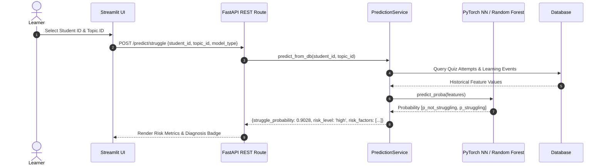
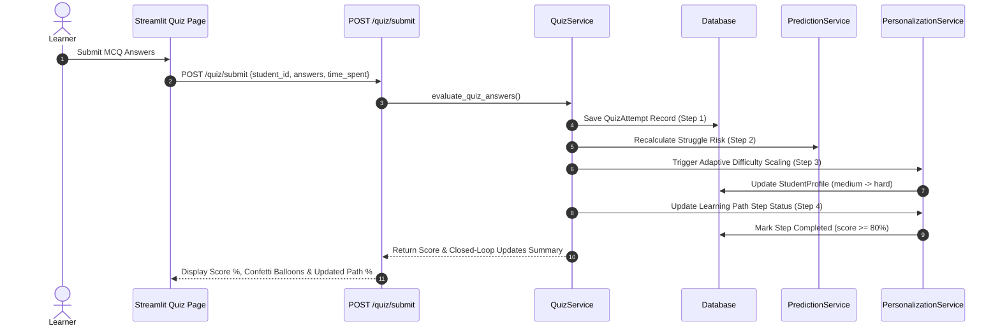

# EduSense AI — System Architecture & Technical Specification

## 🏛️ High-Level System Architecture

**EduSense AI** is structured as an enterprise multi-layer SaaS application following clean architecture, decoupled micro-components, and strict data layer boundaries.

```mermaid
graph TD
    subgraph Presentation Layer
        UI[Streamlit Dashboard :8501]
        Docs[FastAPI Swagger UI /docs]
    end

    subgraph Security & API Gateway Layer
        MW[RequestID & Rate Limiting Middleware]
        AUTH[JWT OAuth2 Security Handler]
    end

    subgraph Service Orchestration Layer
        PS[Prediction Service]
        RS[Recommendation Service]
        PERS[Personalization Service]
        NLP[NLP Feedback Service]
        TUT[Tutor Service]
        QS[Quiz Closed-Loop Service]
    end

    subgraph Machine Learning & AI Layer
        RF[Random Forest Classifier]
        LR[Logistic Regression Baseline]
        NN[PyTorch Deep MLP Neural Net]
        TFIDF[TF-IDF Content Vectorizer]
        OLLAMA[Socratic LLM Engine / Fallback AI]
        HF[HuggingFace Sentiment Analyzer]
        MCQ[AI MCQ Question Generator]
    end

    subgraph Data & Persistence Layer
        DB[(SQLite / PostgreSQL ORM Database)]
        PARQ[(Parquet Preprocessed Datasets)]
        ARTS[(PyTorch & Joblib Model Artifacts)]
    end

    UI -->|HTTP Requests| MW
    Docs -->|HTTP Requests| MW
    MW --> AUTH
    AUTH --> Service Orchestration Layer

    PS --> RF
    PS --> LR
    PS --> NN

    RS --> TFIDF
    TUT --> OLLAMA
    NLP --> HF
    QS --> MCQ

    Service Orchestration Layer --> DB
    Machine Learning & AI Layer --> ARTS
    Machine Learning & AI Layer --> PARQ
```

---

## 🔄 Core Data Flow Pipelines

### 1. Struggle Prediction Pipeline


### 2. Closed Learning Loop Quiz Submission Pipeline


---

## 📦 Module Directory Structure

```
EduSense_AI/
├── app/                        # FastAPI Web Backend Application
│   ├── api/routes/             # REST API Router Endpoints
│   │   ├── auth.py             # JWT Auth, Register, Login, /me
│   │   ├── health.py           # Health checks & System Status
│   │   ├── nlp.py              # Sentiment & Feedback Analysis
│   │   ├── personalization.py  # Adaptive Difficulty & Learning Paths
│   │   ├── prediction.py       # ML Struggle Risk Predictions
│   │   ├── quiz.py             # AI Quiz Generation & Closed Loop
│   │   ├── recommendations.py  # Content Recommendations
│   │   └── tutor.py            # Socratic LLM Chat & History
│   ├── core/                   # Infrastructure Configurations
│   │   ├── config.py           # Environment Settings
│   │   ├── logging.py          # Structured JSON Logger
│   │   ├── middleware.py       # Request ID & IP Rate Limiting
│   │   └── security.py         # Password Hashing & JWT Bearer
│   ├── db/                     # Database ORM Layer
│   │   ├── models.py           # SQLAlchemy Data Models
│   │   └── session.py          # Engine & Session Makers
│   ├── schemas/                # Pydantic Request/Response Models
│   └── services/               # Service Layer Orchestrators
├── ml/                         # Machine Learning & AI Core
│   ├── artifacts/              # PyTorch Weights & Scaler Artifacts
│   ├── data/processed/         # Engineered Parquet/CSV Datasets
│   ├── features/               # Feature Pipeline & Transformers
│   ├── generators/             # Dynamic MCQ Question Generator
│   ├── llm/                    # Ollama LLM Engine & Socratic Fallback
│   ├── models/                 # PyTorch Neural Net & Classical Models
│   ├── nlp/                    # Feedback Preprocessor & Transformers
│   ├── recommender/            # TF-IDF Content Recommendation Engine
│   └── training/               # Model Training Pipelines
├── frontend/                   # Streamlit Interactive Dashboard
│   └── main.py                 # Multi-Page Dashboard UI
├── tests/                      # Automated Pytest Test Suite (39+ Tests)
├── docs/                       # Project Architecture & AWS Deployment Docs
├── Dockerfile                  # Production Multi-Stage Backend Build
├── Dockerfile.frontend         # Streamlit UI Container Image
└── docker-compose.yml          # Multi-Container Service Orchestration
```
